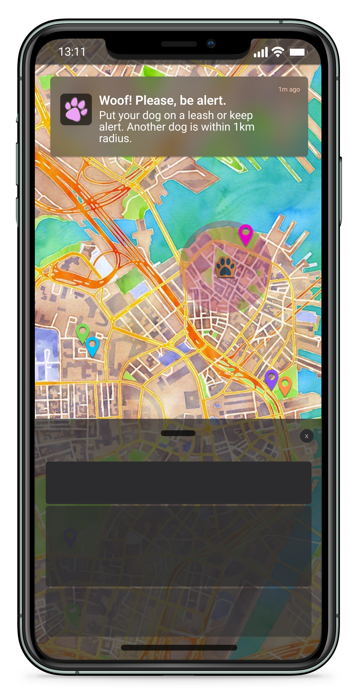

   
  
  
  
  # _Welcome to my Github profile._
  ###### You might not find much here as I am new, but I am busy with many projects which I will make public soon. 
  ###### So keep coming back and you might find something you like... or don't, either way I'll be here.
   
  • Computer vision •Image processing • IoT •

 

 

## Table of Contents

- [A bit of Background](#A-bit-of-Background)
- [Academic Projects](#Academic-Projects)
- [Personal Projects](#Personal-Projects)
- [Contact](#contact)
<!-- * [License](#license) -->

 

# A bit of Background...

I am currently in my first year of studying B. Sc. Software Engineering at CODE University of Applied Sciences. I previously obtained my B. Soc. Sc. Geography + Environmental Sciences and Criminology at Monash University. Due to the time that has passed since obtaining my B. Soc. Sc. and how much the industry involving geography information systems has developed, I felt it was necessary to pursue more relevant and advantageous skills to better myself as a GIS specialist and to have the skill set to not only be able to use the tools available today, but develop them as well.

- B.S. Software Engineering Student at <a href="https://code.berlin/en/">CODE University of Applied Sciences</a>.
- Previous Education + Qualifications:
  - B.A. Criminology + Geography & Enviromental Sciences obtained at <a href="https://www.monash.edu/">Monash University</a>. \* Specialising in geographical Information Systems.

 

# Academic Projects:

## CODE:META

 

 

> By experimenting with prototype driven research we aim to better understand how digital and physical educational spaces might affect connection and a sense of presence between students on and off-campus (specifically CODE campus) environment, and improve the virtual experience.

 

## Alien Invaders

 

 

> Then game is built according to the Python Crash Course Project 1 found in chapters 12 to 14, 2nd Edition by E. Matthes as well as the instructions provided by the lecturers. The game has the following desired characteristics:
>
> - A start and retry menu (mouse only visibility when menu is), Background + background animation, Player ship, which can move left and right with the ability to fire bullets,
> - A fleet of aliens descending from above, their intensity increases with each passing level, 👾👾👾👾👾
> - 🍺 A GIFT FROM THE HEAVENS! 🍺 A magical ice-cold beer to help get you in the mood to fight, and
> - A score board of the current level, your current score, the highest score, fallen foes and how many repair kits (extra lives) you have left, if the alien ship crashes into yours, or passes you... your ship is very baldy damaged.
>   The Repo can be found [here.](https://github.com/berlin-experiment/CODE-OS-Assessment-Task-Fs-2021)

 

## Comparison Game

 

 

> Simple number comparison game for weekly assessment.
> Task Requirements:
>
> - The game starts by asking the user to pick a number between 1 and 100.
> - Then, the computer generates a random number between 1 and 100. (For this step, you'll have to do some research on how to generate a random number in Python. You'll likely get to know a new keyword "import" that you haven't learned about yet. Don't worry too much if you don't understand it yet. We'll learn more about imports in the upcoming sessions)
> - Now, compare those two numbers. The higher number wins. The same numbers are a tie. (For this step you'll likely run into error messages. Take some time trying to understand the error.)
> - Return a different message to the user based on the outcome of the game.
> - Bonus: Use functions to allow the user to repeat the game.
>   The Repo can be found [here.](https://github.com/berlin-experiment/Task01-foundations-spring2022-module-SE01-SE19)

 

# Personal Projects:

## POOCHPING

 

 

> A native app for pet parents. When a user chooses to take their four-legged friend for an outing and allowing access to their location, and I feel the app should only be granted access while activated by the user, PoochPing will use this similarly to how runner apps are used to track progress and accurately track their live location, and at the same time calculate the distance between them and other users. This is used in conjunction with the color collar system to determine if the user should receive a push notification to alert them of a potential trigger for their dog, whether the other user has a smaller breed which your dog should avoid, a nervous dog that you need to be considerate of, or if the dog is listed as "non-friendly" and all in the area need to practice a safe social distance.

 

